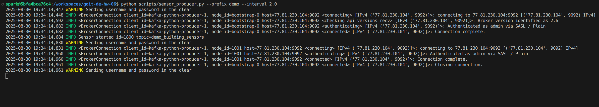

# [Домашнє завдання до теми «Spark streaming»](https://www.edu.goit.global/learn/25315460/26851475/28494004/homework)

## Опис домашнього завдання
Необхідно для потоку даних з Kafka-топіку, що генерується сенсорами, створити програму, що буде аналізувати дані та записувати алерти в alert-Kafka-топік за виконання певних умов.

### Покрокова інструкція виконання

1. Генерація потоку даних:
    - Вхідні дані — це дані з Kafka-топіку, такі самі, як і в попередньому домашньому завданні ([goit-de-hw-05](https://github.com/nickolas-z/goit-de-hw-05)).
    - Згенеруйте потік даних, що містить `id`, `temperature`, `humidity`, `timestamp`. Можна використати раніше написаний вами скрипт та топік.
2. Агрегація даних:
    - Зчитайте потік даних, що ви згенерували в першому пункті. За допомогою `Sliding window`, що має довжину 1 хвилину, `sliding_interval` — 30 секунд, та `watermark duration` — 10 секунд.
    - Знайдіть середню температуру та вологість.
3. Знайомство з параметрами алертів:
    - Ваш начальник любить змінювати критерії алертів. Тому, щоб деплоїти код кожного разу, параметри алертів вказані в файлі: [alerts_conditions.csv](./data/alerts_conditions.csv)
    - Файл містить максимальні та мінімальні значення для температури й вологості, повідомлення та код алерту. Значення `-999`,`-999` вказують, що вони не використовується для цього алерту.
    - Подивіться на дані в файлі. Вони мають бути інтуїтивно зрозумілі. Ви маєте зчитати дані з файлу та використати для налаштування алертів.
4. Побудова визначення алертів:
    - Після того, як ви знайшли середні значення, необхідно встановити, чи підпадають вони під критерії у файлі (підказка: виконайте cross join та фільтрацію).
5. Запис даних у Kafka-топік:
    - Отримані алерти запишіть у вихідний Kafka-топік.
    - Приклад повідомлення в Kafka, що є результатом роботи цього коду:
        ```json
        {
            "window": {
                "start": "2024-08-18T16:08:00.000+03:00",
                "end": "2024-08-18T16:09:00.000+03:00"
            },
            "t_avg": 56.61538461538461,
            "h_avg": 58.07692307692308,
            "code": "104",
            "message": "It's too hot",
            "timestamp": "2024-08-18 16:05:50.907777"
        }
        ```
### Критерії прийняття

1. Генерація даних сенсорів.
2. Знаходження середніх значень показників.
3. Побудова фільтраційного механізму, що визначить, які записи є алертами.
4. Запис даних у Kafka-топік.

### Результат

1. Створення топіків:

```bash
python scripts/create_topic.py demo
```
- [create_topic.py](./scripts/create_topic.py)
- [app-20250830-130644.log](./out/app-20250830-193246.log)


2. Симуляція сенсора (продюсер) (one process == one sensor):

```bash
python scripts/sensor_producer.py --prefix demo --interval 2.0
```
- [sensor_producer.py](./scripts/sensor_producer.py)
- [app-20250830-193414.log](./out/app-20250830-193414.log)


3. Обробка (reads building_sensors and emits alerts):

```bash
python scripts/sensor_processor.py --prefix demo
```
- [sensor_processor.py](./scripts/sensor_processor.py)
- [app-20250830-193540.log](./out/app-20250830-193540.log)


4. Відправка фільрованих даних (prints alerts):

```bash
python scripts/alert_consumer.py --prefix demo
```
- [alert_consumer.py](./scripts/alert_consumer.py)
- [app-20250830-193712.log](./out/app-20250830-193712.log)


5. Spark Streaming

```bash
python scripts/spark_streaming.py --prefix demo
```
- [spark_streaming.py](./scripts/spark_streaming.py)
- [app-20250830-193849.log](./out/app-20250830-193849.log)


6. Запуск dashboard (демонстрація роботи системи):

```bash
python scripts/dashboard.py --prefix demo --start-producer --start-processor --start-alerts --start-spark-streaming
```
- [dashboard.py](./scripts/dashboard.py)
- [app-20250830-192725.log](./out/app-20250830-192725.log)


### Вихідний код
- [Scripts](./scripts/)
- [Logs](./out/)

### Репозиторій
[goit-de-hw-06](https://github.com/nickolas-z/goit-de-hw-06)

